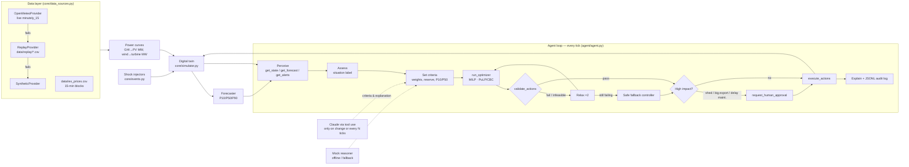

# ⚡ Renewable Energy Orchestrator

An agentic AI control room that re-plans a renewable portfolio every 15 minutes. The portfolio is 5 solar farms (Rajasthan/Gujarat), 3 wind farms (Gujarat/Tamil Nadu), 2 batteries, 4 industrial consumers and a grid interconnection. The agent aims to **minimise cost, maximise clean energy and keep the grid reliable**.

> **Core principle:** the LLM reasons and plans; a MILP optimizer does the math; a validator enforces physics.
> The LLM never produces a number that gets executed.

**Hackathon target:** D2 × F3. The system uses structured, real weather and price data, is demonstrably reliable, and simulates full scenarios (10 shock types, 100-day Monte Carlo).

---

## Quick start

```bash
cd orchestrator
python3 -m venv .venv && source .venv/bin/activate
pip install -r requirements.txt
cp .env.example .env            # optional: add ANTHROPIC_API_KEY to enable the LLM reasoner

pytest                          # 56 tests, ~15 s
streamlit run app.py            # dashboard (works with no API key and no internet)
python -m eval.evaluate --n 100 # Monte Carlo: agent vs baseline vs no-battery (~1-2 min, 8 cores)
```

Tested on Python 3.9 and later; the code uses `from __future__ import annotations`, so it runs unchanged on 3.11+. Without an API key (or if the API fails), a deterministic **mock reasoner** takes over, so the demo always runs. API usage is billed separately from a Claude.ai subscription. The mock reasoner is free.

## Architecture



| Folder | Contents |
|---|---|
| `config/assets.yaml` | Every asset, market and agent parameter, including real lat/lon per farm |
| `core/` | `models`, `simulator`, `events`, `forecaster`, `optimizer`, `validator`, `baseline`, `fallback`, `data_sources`, `power_curves` |
| `agent/` | `agent.py` (loop, approvals, maintenance), `tools.py` (9 tool schemas and implementations), `prompts.py`, `mock_reasoner.py` |
| `eval/evaluate.py` | Monte Carlo runner; writes `eval/results/results.csv`, `summary.csv` and interactive HTML charts |
| `logs/decisions.jsonl` | One line per tick: situation, criteria, attempts, validation, action, approvals, tool calls, KPIs, explanation |
| `tests/` | Physics, optimizer, guardrail, agent (including a scripted fake Claude) and data-layer tests (mocked API) |

### Optimizer (rolling-horizon MILP)
It plans 16 ticks (4 h) ahead, is re-solved every tick, and only the first tick is executed.

- **Variables:** charge and discharge per battery (a binary prevents both at once), grid import and export (a binary sets direction), curtailment per farm, paid demand response, flexible shedding and critical unserved (the last two only when permitted).
- **Constraints:** power balance; SoC dynamics with √η efficiency; rate limits; SoC bounds; battery availability; live line limits; a soft reserve SoC floor.
- **Objective:** `w_cost·(energy + degradation + DR + shedding − sales − terminal SoC value) + w_clean·(curtailment + import carbon) + w_reliability·(reserve shortfall + VOLL·unserved critical)`.
- **Uncertainty modes:** `p50` uses expected values; `p10` uses conservative renewables and P90 demand.
- **Failure handling:** infeasible or failed solves return a status and never raise.

### Real-data layer
- **Open-Meteo:** one request covers all 8 sites, using `minutely_15=shortwave_radiation,wind_speed_100m,cloud_cover,weather_code`. Responses are cached in `data/cache/` (past dates permanently, today/future for 60 min). Every successful fetch is also saved as a replay CSV.
- **Conversion to MW:** PV = Cap · GHI/1000 · PR. Wind uses a cubic curve between cut-in and rated speed and is zero above cut-out.
- **Storm alerts:** raised for WMO codes 95/96/99/65/67/82 or hub-height wind ≥ 20 m/s within the horizon.
- **Fallback:** Open-Meteo → Replay → Synthetic. The dashboard banner shows the **active** source and why it fell back.
- **Prices:** loaded from `data/iex_prices.csv` (IEX-style 15-minute MCP blocks). ⚠️ The shipped file is a **generated sample** shaped like IEX DAM prices and is labelled as such in its first line. Replace it with a real IEX export in the same format (`date, block, time_from, mcp_rs_mwh`). The synthetic source uses its own net-demand-correlated price instead.
- **Replay data:** `data/replay/` ships two real Open-Meteo days (2026-09-25 and 2026-09-26).

## Dashboard
- **Sidebar:** data-source selector, day, seed, LLM toggle, auto-approve toggle, Reset, Play/Pause, Step, speed.
- **Live tab:** active-source banner and KPI cards (cost ₹, clean %, curtailed MWh, unserved load, violations, CO₂). Charts cover generation by source vs demand, battery SoC, buy/sell price, and grid net import against live limits.
- **Agent panel:** situation, weights, reserve, forecast mode, explanation, notes and alerts, plus a button for each of the 10 shock types, the approval queue (Approve/Reject) and the action log.
- **Results tab:** Monte Carlo distributions (box plus all points) for each metric, a P5/mean/P95 table, and a button to run a new batch.

## Results (100 randomized days, 3 unannounced shocks per day, mock reasoner)

All three controllers see identical weather, demand, prices and shocks for each seed. Reproduce with `python -m eval.evaluate --n 100`.

| Mean per day | Agent | Naive baseline | No battery |
|---|---:|---:|---:|
| Cost (₹ lakh) | **72.9** | 86.7 | 93.1 |
| Clean energy | **71.5 %** | 64.3 % | 60.1 % |
| Curtailment (MWh) | **13.7** | 28.0 | 51.6 |
| Unserved load (MWh) | **9.7** | 47.7 | 53.2 |
| Constraint violations | **0.00** (max 0) | 6.06 | 4.64 |
| CO₂ (t) | **576** | 847 | 942 |

- **Cost:** the agent was cheaper than the baseline on 97 of 100 days.
- **Unserved critical load:** the agent had some on 16 days, versus 66 for the baseline. These are physical shortages, for example an unannounced line derate after batteries were legitimately spent on a price spike, or a storm that cuts wind and the import line together. Here the validator rejects every plan, and the safe fallback minimises the shortfall and logs an `EMERGENCY` note.
- **"Violations"** counts executed commands that broke a physical limit (SoC, rate, line, availability). Unserved load is reported separately.

## 9-blocker claim → evidence

These are the nine blockers that usually stop an LLM agent from controlling physical infrastructure. Each row points to where the system addresses it and the test that proves it. *(Rename the rows to match the official hackathon rubric if it uses different wording.)*

| # | Blocker | How it's handled | Evidence |
|---|---|---|---|
| 1 | LLM hallucinates numbers | Tools accept only criteria, ids and text; MW values come from the MILP | `agent/tools.py`, `test_full_day_with_llm_tool_use` |
| 2 | Physically unsafe actions | Validator checks SoC, rate, line, balance, critical load and availability before every execution; the simulator independently clips and counts violations | `core/validator.py`, `tests/test_guards.py`, MC: 0 violations in 100 days |
| 3 | Solver infeasibility or crash | Clear status, relax ×2, then a safe fallback that always respects hard limits | `test_infeasible_handled_without_crash`, `test_relax_then_fallback_on_infeasible`, `test_fallback_always_valid_over_stressed_day` |
| 4 | LLM outage or no API key | Mock reasoner is used transparently, and each decision records which reasoner ran | `test_full_day_without_api_key`, `test_llm_outage_falls_back_to_mock` |
| 5 | Data-source outage | Open-Meteo → Replay → Synthetic with caching; the active source is shown in the UI | `tests/test_data_sources.py` (mocked HTTP errors, timeouts, malformed payloads) |
| 6 | Forecast uncertainty | P10/P50/P90 forecasts; the agent switches to conservative P10 for storms, failures and surges; rolling re-plans | `test_forecast_quantiles_ordered_and_nowcast_exact`, `test_p10_mode_is_more_conservative`, `test_storm_raises_reserve_and_uses_p10` |
| 7 | No human oversight | Shedding, exports over 50 MW and maintenance delays go to an approval queue; the plan is re-optimised without them until approved | `test_human_approval_gates_large_export` |
| 8 | Not auditable or explainable | JSONL record per tick (criteria, attempts, validation, tool calls, KPIs) plus a plain-English rationale | `logs/decisions.jsonl`, `test_full_day_without_api_key` |
| 9 | Unproven value and runaway LLM cost | 100-day Monte Carlo against two baselines; the LLM is called only when the situation changes or every N ticks | `eval/results/`, `test_full_day_with_llm_tool_use` (throttling asserted) |

## Events
`cloud_cover`, `wind_surge`, `wind_drop`, `price_spike`, `battery_unavailable`, `line_congestion`, `demand_surge`, `forecast_update`, `storm_alert` (arrives after a 2 h lead: turbines cut out, solar dims, line derates, WMO code 95 is written into the weather), and `maintenance_window` (the agent moves it to the lowest-impact slot; a delay needs approval).

## Limitations
- Single-bus model with no intra-portfolio network flows. Frequency is a proportional proxy of imbalance.
- Demand is synthetic for every data source. Prices are a labelled sample until a real IEX file is dropped in.
- Forecasts are future truth plus autocorrelated noise, not a trained model.
