# ⚡ Renewable Energy Orchestrator

An **autonomous** AI control room for an industrial renewable energy portfolio. Every 15 minutes, and immediately after any shock, it decides how to run solar farms, wind farms, batteries, flexible loads and the grid connection. The goals are to **minimise cost, maximise clean energy and never cut critical load**. There is no human in the loop: the AI decides, acts and explains, and every action is logged.

It works for **any industry**. You describe your site (loads, consumption data, generation resources, limits, maintenance and breakdown schedule, conservation hours, carbon and cost targets) in the dashboard, and the AI adapts.

> **Core principle:** the AI reasons over *all* signals at once, a MILP optimizer computes the megawatts, a
> stress test measures risk across 100 possible futures, and a validator enforces physics. An LLM, when
> enabled, can only choose among plans that already passed those checks. It never produces a number that
> gets executed.

---

## Quick start

```bash
cd orchestrator
python3 -m venv .venv && source .venv/bin/activate
pip install -r requirements.txt
cp .env.example .env            # optional: add ANTHROPIC_API_KEY to let Claude choose & explain

streamlit run app.py            # dashboard (works with no API key and no internet)
pytest                          # 70 tests (~5 min: several simulate full days)
python -m eval.evaluate --n 100 # Monte Carlo: AI vs business-as-usual vs no-battery
```

Runs on Python 3.9+. Without an API key (or if the API fails) the optimizer and priority ladder decide on their own, so the demo always runs and is free. API usage is billed separately from a Claude.ai subscription.

## How the AI decides

There are no situation "cases" and no fixed playbook. Every tick runs one pass in which nothing is thrown away:

```mermaid
flowchart LR
    subgraph IN["Inputs (from your industry + live data)"]
        D[Real-time demand<br/>& consumption data]
        R[Resources, capacities<br/>& limits]
        M[Maintenance &<br/>breakdown schedule]
        T[Carbon & cost targets,<br/>risk tolerance]
        W[Weather: live → last-year proxy<br/>→ saved day → simulated]
        P[Prices: IEX 15-min]
    end
    IN --> PER[PERCEIVE<br/>state + learned P10/P50/P90<br/>forecasts + alerts with probabilities]
    PER --> DIA[DIAGNOSE<br/>9 continuous signals,<br/>all measured together]
    DIA --> OPT[OPTIONS<br/>search inside 5 recipe bands:<br/>explore 15 → refine 6 combinations]
    OPT --> ST[STRESS-TEST<br/>each plan × 100 futures<br/>avg ₹ · worst ₹ · P shortfall]
    ST --> CH[CHOOSE<br/>priority ladder<br/>± Claude among eligible]
    CH --> VER{VERIFY<br/>physics validator}
    VER -->|fail| REP[repair: relax ×2] --> FB[safe fallback]
    VER -->|pass| ACT[ACT autonomously<br/>+ explain + log]
    FB --> ACT
    ACT --> OUT[Outputs: actions log, energy produced,<br/>money & CO₂ saved, efficiency, clean %]
    ACT --> LRN[LEARN<br/>forecast bias & band width,<br/>saved for tomorrow]
    LRN -.-> PER
    DA[Day-ahead 24 h plan<br/>re-based after shocks] -.battery target.-> OPT
```



1. **Perceive:** current state, forecasts already corrected by what the AI has learned, prices, and alerts that carry a **probability** (e.g. "storm 35% likely in 90 min").
2. **Diagnose:** nine continuous signals, measured together: storm probability, price vs normal, grid-line headroom, batteries in service, generation offline, demand surprise, renewable shortfall, battery charge, CO₂ budget pace. A storm and a price spike at the same time are both kept and both affect the decision.
3. **Options, as recipe bands.** A recipe isn't one fixed setting but a **range for every parameter**:

   | Recipe | Battery reserve | Price sensitivity | Clean weight | Reliability weight | Forecast caution | Demand-response use |
   |---|---|---|---|---|---|---|
   | Max savings | 5–30% | 55–80% | 10–30% | 5–20% | 0–30% | 100% |
   | Green-lean | 15–45% | 20–40% | 45–70% | 10–25% | 0–40% | 100% |
   | Balanced | 20–50% | 35–55% | 20–40% | 20–35% | 20–60% | 100% |
   | Protective | 45–75% | 20–40% | 10–25% | 40–65% | 50–90% | 100% |
   | Fortress | 70–90% | 10–25% | 5–15% | 60–85% | 80–100% | 100% |

   *Demand-response use* is kept at 100% by default: an A/B test showed that letting the AI restrict it raised cost by ₹2.6 L/day. It stays editable as a contractual cap.

   Every decision, the AI **explores** 3 combinations per band (15 total), then **refines** with 6 more around the best one. Each combination becomes an exact MW plan via the MILP optimizer, aimed at the **day-ahead plan's** battery trajectory (re-solved after every shock). *Forecast caution* blends smoothly from expected (P50) to pessimistic (P10 renewables / P90 demand). Bands are editable per industry in the Setup tab or `config/assets.yaml`.
4. **Stress-test:** each combination is replayed in 100 sampled futures. Futures are drawn from the forecast uncertainty and from each alert's probability, so a 35% storm hits in about 35 of them. The result is average cost, worst-case (P95) cost, the **probability of cutting critical load**, CO₂, curtailment and battery wear.
5. **Choose, using a priority ladder with thresholds:**
   1. *Safety:* the plan must pass the physics validator.
   2. *Reliability:* shortfall risk must be within **your** tolerance (default 2%).
   3. *Cost vs clean:* best score = avg cost + risk aversion × (worst − avg) + carbon-pressure × (CO₂ + curtailment value).
   4. *Battery life:* among near-equal plans, pick the one with the least wear.

   With an API key, Claude sees the whole briefing and may pick a different **eligible** plan, with its reasoning. Anything else is rejected by code.
6. **Verify → act → explain:** validate again; if nothing is valid, repair (allow controlled flexible-load reduction), then fall back to the safe controller. Then execute and write a 2–3 sentence explanation, e.g. *"I tested 21 combinations from 5 recipe bands across 100 futures and chose a 'Protective' plan (≥67% reserve)… 'Max savings' would save ₹84,597 but risks a critical shortfall in 54% of futures (limit 2%)."*
7. **Learn:** compare every 1-hour-ahead forecast with what happened, learn each resource's bias and how wide the P10–P90 band should be, apply that immediately, and save it to `data/learning.json` for the next day.

**Operations, also autonomous:** maintenance jobs that may move are shifted into the slot that loses the least energy × price. Breakdowns get an inspection crew immediately, which shortens the outage.

### Why probability matters

The chosen protection depends on *how likely* a risk is, through the stress test rather than a rule. Measured on one simulated day with a storm forecast at 18:00 (`tests/test_agent.py::test_protection_rises_with_storm_probability`):

| Storm probability | 0% | 10% | 50% | 90% |
|---|---|---|---|---|
| Battery reserve chosen | 17% | 41% | 49% | 57% |
| Forecast caution | 15% | 34% | 89% | 89% |

Because the AI searches *inside* the recipe bands, protection rises smoothly with the risk instead of jumping between a few fixed plans.

When a storm would threaten **critical** load (e.g. batteries nearly empty at dawn), any probability above your tolerance triggers protection, because that is what "2% acceptable risk" means. Raise the tolerance slider and the AI accepts more risk for lower cost.

## Your industry: inputs the dashboard accepts

| Input (Setup tab) | Used for |
|---|---|
| Loads: typical MW, critical %, demand-response eligibility, daily shape | Demand model; critical load is never cut voluntarily |
| Utility consumption CSV (one column per load) | Replaces the demand shape with your real data (any time step, resampled to 15 min) |
| Solar / wind farms with lat-lon and capacity; batteries | Weather → MW via standard power curves; dispatch |
| Grid import / export limits | Hard constraints (live-derated by congestion and storms) |
| Maintenance & breakdown schedule | Breakdowns fixed; maintenance with "± hours" is moved by the AI |
| Energy conservation schedule | Planned demand reduction windows |
| Annual CO₂ target, target ₹/MWh, risk tolerance, worst-case aversion | Ladder thresholds and scoring |

Profiles can be saved and loaded (`config/profiles/*.yaml`). The default is a Rajasthan / Gujarat / Tamil Nadu portfolio (`config/assets.yaml`).

## Data sources
- **Live:** Open-Meteo `minutely_15` (shortwave radiation, 100 m wind, cloud cover, weather code), one request for all sites and cached.
- **Proxy:** the same calendar day **one year earlier** from the Open-Meteo archive (hourly, interpolated to 15 min). Used automatically if live fails.
- **Replay:** saved real days in `data/replay/`. **Synthetic:** statistical weather.
- **Fallback chain:** Live → Last year → Replay → Synthetic. The sidebar shows the active source and why.
- **Storm alerts** come from WMO codes 95/96/99/65/67/82 or hub-height wind ≥ 20 m/s, with a probability that decays with lead time.
- **Prices:** `data/iex_prices.csv` in IEX 15-minute block format. ⚠️ The shipped file is a **generated sample** (labelled in its first line); replace it with a real IEX export.

## Dashboard
1. **🏭 Your industry:** all the inputs above, with validation, *Apply & start day* and *Save as profile*.
2. **⚡ Live control room:**
   - **Status line:** e.g. "🟠 18:00 — Storm risk 35% in 90 min · Price 2.1× normal → AI decision: Protective".
   - **Output cards:** energy produced, money saved, carbon saved, clean %, generation efficiency, load cut / violations. Savings are measured against a business-as-usual twin running the same day with the same shocks.
   - **Charts:** where the power came from, battery charge vs the AI's chosen reserve, price, grid flow vs line limits.
   - **What the AI is thinking:** all signals as bars, the diagnosis, the decision and its explanation, and a table of every plan considered with its stress-test numbers and why it won or lost.
   - **Make something happen:** inject any of 11 events with parameters (storm probability and arrival, which farm breaks, how bad). The AI re-plans immediately.
3. **📊 Results & learning:** today's AI vs business-as-usual, clean vs traditional energy, what the AI has learned (error before and after), and the Monte Carlo proof.

## Results

100 randomized synthetic days, 3 unannounced shocks per day (storms with random probabilities, breakdowns,
price spikes, congestion, …), offline mode. All controllers see identical weather, demand, prices and shocks.
Reproduce with `python -m eval.evaluate --n 100` (about 13 min on 8 cores).

| Mean per day | **AI** | Business-as-usual | No battery |
|---|---:|---:|---:|
| Cost (₹ lakh) | **72.0** (−23%) | 93.2 | 100.3 |
| Clean energy | **72.5 %** | 61.9 % | 57.6 % |
| Curtailment (MWh) | **9.9** | 22.3 | 44.1 |
| Load cut (MWh) | **5.4** (−82%) | 29.5 | 32.3 |
| Safety violations | **0.00** (max 0) | 4.85 | 3.59 |
| CO₂ (t) | **554** (−42%) | 949 | 1054 |

- **Cost:** the AI was cheaper on **100 of 100** days.
- **Critical load cut:** the AI had some on 8 of 100 days, vs 20 for business-as-usual. These are physical shortages that no plan can cover, e.g. a storm hitting while the line is congested. The AI then protects critical load first and says so.
- **Recipe bands vs fixed plans (A/B on the same 100 days):** bands with full demand response cost ₹71.97 L/day vs ₹72.07 L/day for 9 fixed plans (cheaper on 59/100 days, slightly less CO₂, slightly more load cut: 5.4 vs 5.2 MWh). That's a small edge near the noise level. A first version that also searched over demand-response limits was clearly worse (₹74.7 L/day). Configs and results: `eval/ab/`.
- **"Safety violations"** are executed commands that broke a physical limit (SoC, rate, line, unavailable asset). Load cut is reported separately.

## Blocker → evidence

| # | Blocker | How it's handled | Evidence |
|---|---|---|---|
| 1 | LLM hallucinates numbers | The LLM can only pick a plan id among validated, stress-tested plans; MW come from the MILP | `agent/tools.py`, `test_llm_cannot_choose_ineligible_plan` |
| 2 | Physically unsafe actions | Validator before every execution; simulator independently clips and counts violations | `core/validator.py`, `tests/test_guards.py`, Monte Carlo violations |
| 3 | Rigid "case" logic | 9 continuous signals together; plans scored against probability-weighted futures | `test_all_signals_kept_together`, `test_protection_rises_with_storm_probability` |
| 4 | Solver infeasibility / physical shortage | Clear status → relax ×2 → safe fallback, with a plain explanation | `test_infeasible_handled_without_crash`, `test_portfolio_without_wind_or_batteries_runs` |
| 5 | LLM outage / no key | Optimizer + ladder decide alone; every decision records who decided | `test_llm_outage_keeps_running`, `test_full_autonomous_day` |
| 6 | Data-source outage | Live → last-year proxy → replay → synthetic, cached, shown in UI | `tests/test_data_sources.py` (mocked HTTP) |
| 7 | Asset breakdowns & maintenance | Outages modelled per asset; crews dispatched; flexible maintenance moved autonomously | `test_breakdown_triggers_autonomous_crew`, `test_maintenance_moved_without_approval` |
| 8 | Not industry-agnostic | Any loads/assets/targets via Setup tab or YAML profile; custom consumption data | `tests/test_industry.py` |
| 9 | Doesn't improve | Online forecast-bias & calibration learning, persisted daily | `test_learning_reduces_forecast_error`, `test_learning_persists_between_days` |
| 10 | Unproven value | 100-day Monte Carlo vs two baselines + live savings vs a twin | `eval/results/`, `test_operation_measures_savings_vs_baseline` |

## Code map

| Path | What it does |
|---|---|
| `agent/agent.py` | The autonomous loop (perceive → … → learn), priority ladder, repair, operations |
| `agent/recipes.py` | Recipe bands, explore / refine search |
| `agent/signals.py` | DIAGNOSE: continuous signals and human-readable headline |
| `agent/stress_test.py` | Future sampling (forecast quantiles + storm probabilities) and plan replay |
| `agent/narrator.py`, `prompts.py`, `tools.py` | Offline explanations; LLM prompt and the single `submit_decision` tool |
| `agent/runner.py` | AI twin + business-as-usual twin in lockstep, headline outputs |
| `core/optimizer.py` | Rolling-horizon MILP (PuLP/CBC); LP mode for the day-ahead plan |
| `core/learning.py` | Online forecast-bias and band-width learning |
| `core/simulator.py`, `events.py` | Digital twin, outages/maintenance, hidden storm outcomes, 11 shocks |
| `core/data_sources.py` | Live / last-year / replay / synthetic weather, IEX prices, storm alerts |
| `core/config.py` | Industry profiles: load, validate, save |

## Limitations
- Single-bus model; frequency is a proportional proxy of imbalance.
- Demand comes from shapes or your uploaded data; prices are a labelled sample until a real IEX file is added.
- Forecasts are simulated (future truth + bias + noise), not a trained weather model; learning corrects bias and calibration only.
- The band search samples 21 combinations per decision. It finds very good combinations, but not a mathematically proven optimum (that would need full stochastic optimisation).
